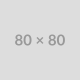

  
  
  
  
  
  

  

  <h3 align="center">Repo Maintenance PAT Test (Public)</h3>

  

    Sandbox: testing release flow without REPO_MAINTENANCE_PAT - safe to delete
  

  

| :warning: Notice: This project does not currently have a license set. Until a license is added, no one may legally use, copy, modify, or distribute this code without your explicit permission. |
| --------------------------------------------------------------------------------------------------------------------------------------------------------------------------------------------- |

Describe your project here.

## Documentation

For detailed documentation, clone this repo and open `docs-site/index.html`.

## Questions/Comments

If you have questions, comments, etc, please enter a GitHub Issue with the "question" tag.

## Contributing/Bug Reporting

Contributions and bug reports are gladly accepted! Please see [CONTRIBUTING.md](CONTRIBUTING.md) for details.

## Contributors

<!-- spell-checker:disable -->
<!-- ALL-CONTRIBUTORS-LIST:START - Do not remove or modify this section -->
<!-- prettier-ignore-start -->
<!-- markdownlint-disable -->
<table>
  <tbody>
    <tr>
      <td align="center" valign="top" width="14.28%"><a href="https://github.com/natescherer"> <b>Nate Scherer</b></a> <a href="#code-natescherer" title="Code">💻</a></td>
    </tr>
  </tbody>
</table>

<!-- markdownlint-restore -->
<!-- prettier-ignore-end -->

<!-- ALL-CONTRIBUTORS-LIST:END -->
<!-- spell-checker:enable -->

This project follows the [all-contributors](https://allcontributors.org) specification.
Contributions of any kind are welcome!

## Repository Template

This repository is based on the [Postmodern Repo Copier Template](https://github.com/natescherer/postmodern-repo-copiertemplate).
